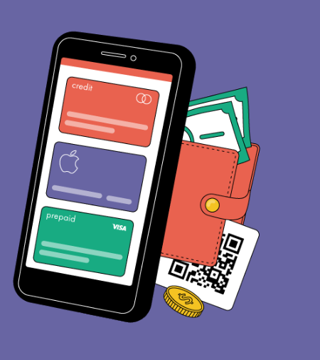

# youEconomy.

  

## General objectives:

- Build an App using TypeScript, React, React toolkit, Redux, Node and Sequelize.
- Practice the GIT workflow with the Scrum method.
- Use and practice tests.

## Used technology:

- [ ] React
- [ ] Redux Toolkit
- [ ] Express
- [ ] Sequel - Postgres
- [ ] Json web token
- [ ] Bcrypt

##### BoilerPlate:

The boilerplate has two folders: `api` and `client`. In these folders will be the back-end and front-end code respectively.

The `client` content was created using: Create React App.

##### Application goals:

User:

- Recorder of personal daily expenses
- Show detailed spending information.
- Filter / Sort them

##### Instructions to download/run the project:

git clone: ​​https://github.com/Elevattd/youEconomy

- Inside the console, go to client/ and do npm install -> npm start
- Inside the console, go to api / and do npm install / Create .env\* file -> npm run dev

\*Inside the .env file create 2 variables -> ACCESS_TOKEN_SECRET and REFRESH_TOKEN_SECRET -> they must have the same value, and it has to be alphanumeric.

##### Contact:

-marianoo.14.md@gmail.com

- https://www.linkedin.com/in/mariano-dunand/
